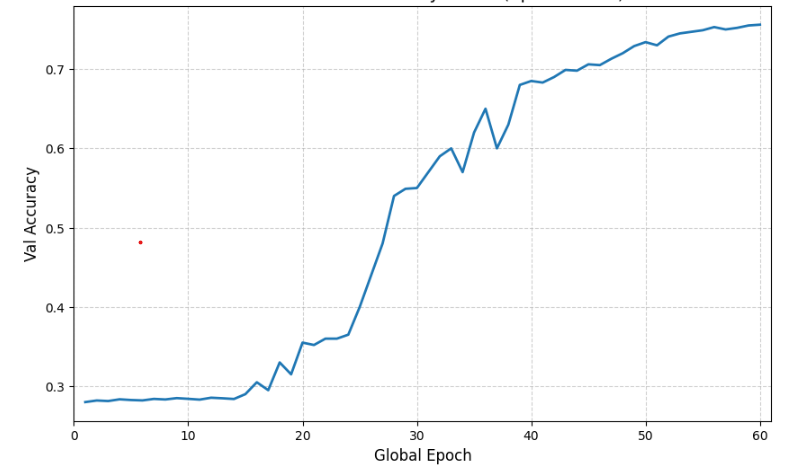

# Energy-Based Cipher Classifier

## Purpose

The energy classifier is used to classify cipher-related patterns and distinguish between different cipher behaviours present in the project. Instead of directly predicting the secret key, the model learns to identify whether a given feature vector corresponds to a valid cipher transformation.

This module acts as the first stage of the pipeline by learning statistical representations of different cipher types and their structural behaviour.

---

## Cipher Types Considered

The project includes the following cipher categories:

- Advanced Encryption Standards(AES)
- Classical substitution-based cipher (Vigenère)
- Lightweight block cipher (SPECK32)
- Feistel-based block cipher (DES)

Each cipher exhibits distinct statistical and structural patterns. The energy classifier learns to differentiate these patterns.

---

## Theoretical Foundation

An Energy-Based Model defines a scalar function:

E(x, y)

where:

x = input feature vector (trace-derived or text-derived features)  
y = cipher class label

The model assigns:

Low energy → correct cipher class  
High energy → incorrect cipher class

---

## Classification Mechanism

During training, the model learns:

- statistical structure of ciphertext or trace features
- distributional differences between cipher types
- structural properties of transformations

This enables the classifier to distinguish between:

- classical polyalphabetic behaviour
- Feistel network leakage patterns
- ARX-based lightweight cipher leakage

---

## Training Objective

The loss function enforces:

E(x, y_true) < E(x, y_false)

This creates an energy margin between correct and incorrect cipher classes.

---

## Output Interpretation

The model produces an energy score for each cipher type.  
The predicted class is the one with minimum energy.

This allows:

- multi-class cipher classification
- statistical validation of cipher behaviour
- feature learning for downstream cryptanalysis

---

## Accuracy 

## Role in the Cryptanalysis Pipeline

The energy classifier:

- learns structural differences between cipher families
- provides feature-level understanding of cipher behaviour
- acts as a preprocessing and analysis stage before key recovery attacks

