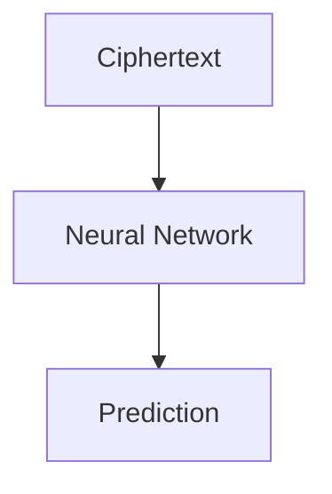

# Interactive Examples

This page demonstrates the interactive components embedded throughout the documentation.

## Mermaid Diagram

The following flowchart is rendered client‑side with **Mermaid.js**:

## Chart.js Graph

Below is an interactive chart powered by **Chart.js** (loaded from CDN):

<canvas id="exampleChart" width="600" height="400"></canvas>

