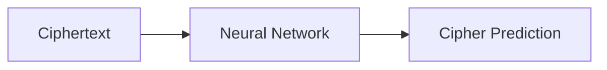

# Methodology

## Cipher Classification

Model trained on ciphertext from AES, DES, Vigenère, and Speck32.

Pipeline:

```mermaid
flowchart LR
  A[Ciphertext] --> B[Neural Network]
  B --> C[Cipher Prediction]
```

Metric: Classification accuracy.
