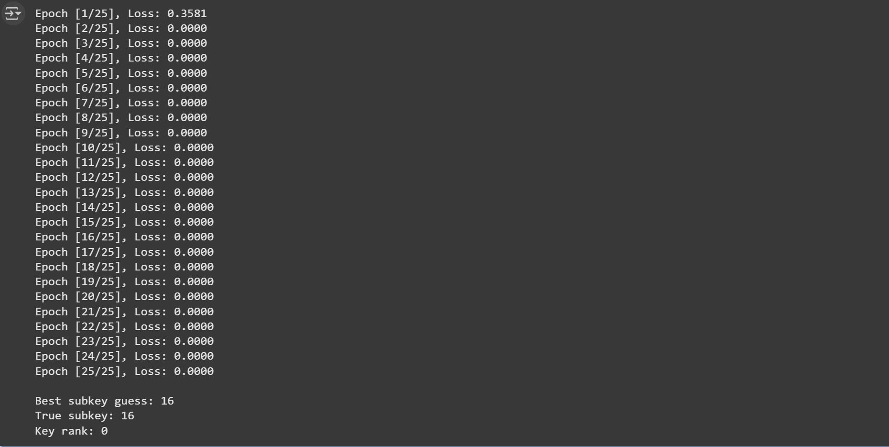
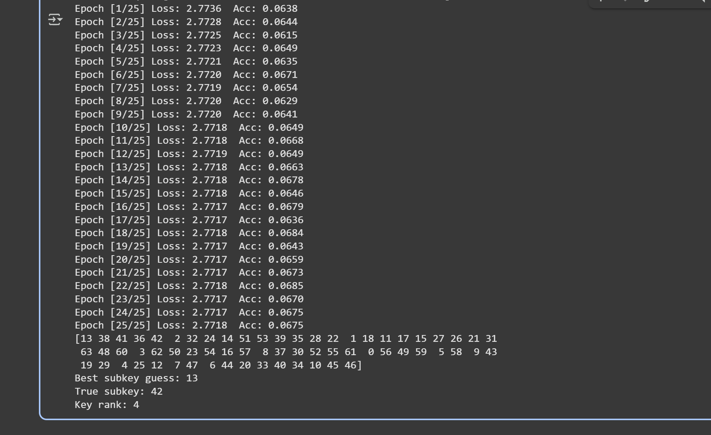

# Side-Channel Analysis of DES and SPECK32

## What is Side-Channel Analysis

Side-Channel Analysis (SCA) exploits physical leakage from cryptographic implementations rather than mathematical weaknesses. Power consumption is data-dependent and can reveal information about intermediate computations.

---

## Leakage Model

The Hamming Weight (HW) model is used:

HW(x) = number of bits set to 1 in x

Power consumption is assumed to be proportional to the Hamming Weight of intermediate values.

---

## SPECK32: Synthetic Trace Generation

Synthetic traces are generated by recording HW values of intermediate operations during encryption:

- rotation output
- modular addition result
- XOR with round key
- final mixing stage

Each round produces four leakage samples.

Trace length = 22 × 4 = 88 samples

Dataset characteristics:

- 10,000 traces
- fixed secret key
- random plaintexts
- Gaussian noise added
- random desynchronization applied

This simulates realistic measurement conditions.

---

## CNN-Based Key Recovery for SPECK32

A Convolutional Neural Network is trained to learn the mapping:

trace → key class

Key rank is used as the evaluation metric.  
Rank 0 indicates successful key recovery.

---

## DES S-box Side-Channel Attack

Instead of predicting the key directly, the model predicts the S-box output (16 classes).

Key recovery procedure:

1. Compute S-box output for each key hypothesis
2. Accumulate log-likelihoods across traces
3. Select the key with maximum likelihood

This follows the template attack methodology with deep learning feature extraction.

---

## Advantages of Deep Learning in SCA

- automatic detection of leakage points
- robustness to noise and misalignment
- no manual feature engineering required

